# 프로젝트 설정

`Windows 10` 기준으로 작성했습니다.

**목차**

* [사전 준비](#사전-준비)
* [프로젝트 복사](#프로젝트-복사)
* [웹 프로젝트 설정](#웹-프로젝트-설정)
  * [Dynamic Web Module 전환](#dynamic-web-module-전환)
  * [Context Root 설정](#context-root-설정)
  * [Build Path 및 의존성 설정](#build-path-및-의존성-설정)
  * [Deployment Assembly 설정](#deployment-assembly-설정)
* [Server 정의](#server-정의)

## 사전 준비

컴퓨터에 [Eclipse](https://www.eclipse.org/downloads/)와 [Git](https://git-scm.com/downloads)이 설치되어 있어야 합니다.
또한 [Apache Tomcat 9](https://tomcat.apache.org/download-90.cgi)와 프로젝트가 의존하는 라이브러리들(`MyBatis`, `Lombok` 등)을 적당한 위치에
저장해두세요.

## 프로젝트 복사

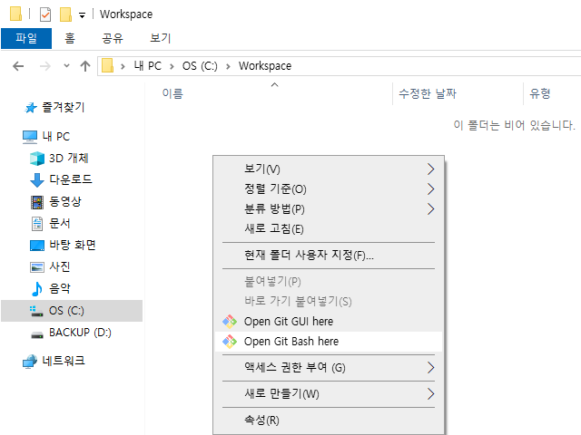

파일 탐색기로 프로젝트를 저장할 작업 공간 폴더를 엽니다. 저는 `C:\Workspace` 폴더를 열었습니다. 파일 탐색기의 바탕을 우클릭하면 메뉴 중 `Open Git Bash Here`가 있을 겁니다. 이 메뉴를
눌러주세요.

이 메뉴가 없다면 `Git`을 설치하지 않았거나 설치 옵션을 다르게 하셨을 겁니다. 설치하지 않으셨다면 설치하시고, 설치 옵션을 다르게 하셨다면 `Git Bash` 프로그램을 직접 실행한 다음, `cd` 명령어를
통해 해당 폴더로 이동하셔야 합니다.

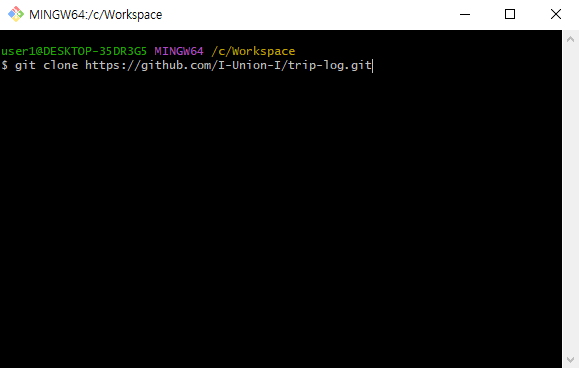

`bash` 창에 `git clone https://github.com/I-Union-I/trip-log.git` 명령어를 입력해주세요. 다음과 비슷하게 출력이 된다면 프로젝트 복사는 성공입니다.

```
Cloning into 'trip-log'...
remote: Enumerating objects: 14, done.
remote: Counting objects: 100% (14/14), done.
remote: Compressing objects: 100% (7/7), done.
remote: Total 14 (delta 0), reused 14 (delta 0), pack-reused 0 (from 0)
Receiving objects: 100% (14/14), done.
```

## 프로젝트 불러오기

`Eclipse`를 실행하여 이전에 프로젝트를 복사한 폴더를 엽니다.

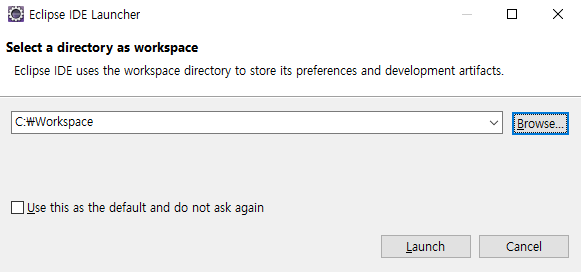

상단의 `File` 버튼을 누르고 그 안의 `Import...` 버튼을 눌러주세요.

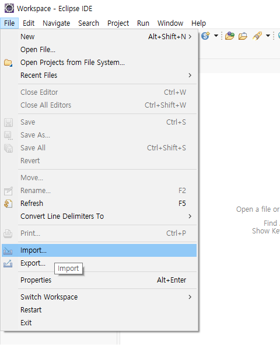

내부 영역의 `General` 탭을 열어주시고, `Projects from Folder or Archive`를 선택하여 다음으로 넘어가주세요.


그런 다음 `Directory...` 버튼을 눌러 이전에 복사한 `trip-log` 폴더를 선택해주세요. 그런 다음 `Finish` 버튼을 누르시면 됩니다.

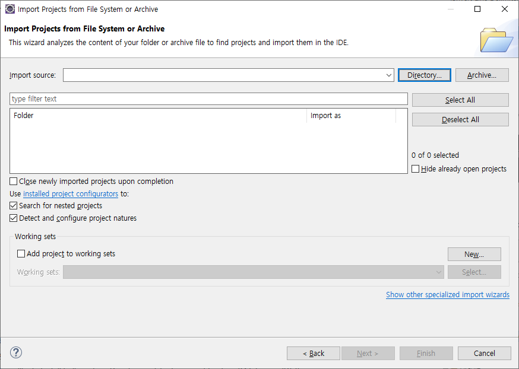

다음과 같이 `Project Explorer`에 `trip-log`가 있으면 성공입니다.

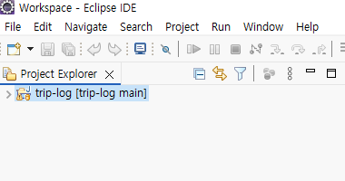

## 웹 프로젝트 설정

이제 상세한 설정을 할 차례입니다.

### Dynamic Web Module 전환

`trip-log` 프로젝트를 우클릭하여 `Properties` 버튼을 눌러주세요.

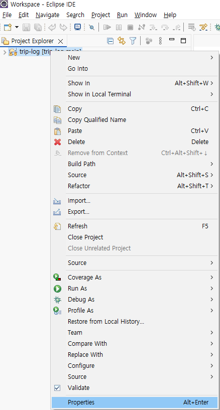

열린 창에서 `Project Facets` 탭을 열어주세요.

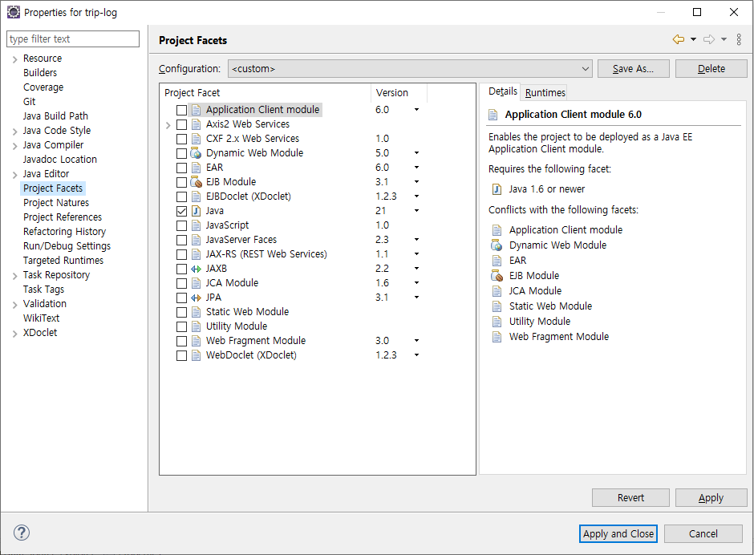

- `Java` 옵션이 선택되어 있지 않다면 선택하고, `Version`을 `11`으로 맞춰주세요. 우측의 `Runtimes` 탭은 건드리지 않아도 될 겁니다.
- `Dynamic Web Module` 옵션이 선택되어 있지 않다면 선택하고, `Version`을 `4.0`으로 맞춰주세요. 그런 다음, 우측의 `Runtimes` 탭을 선택해주세요. 여기에
  `Apache Tomcat v9.0`이 없다면 `New`를 눌러 추가해야 합니다.

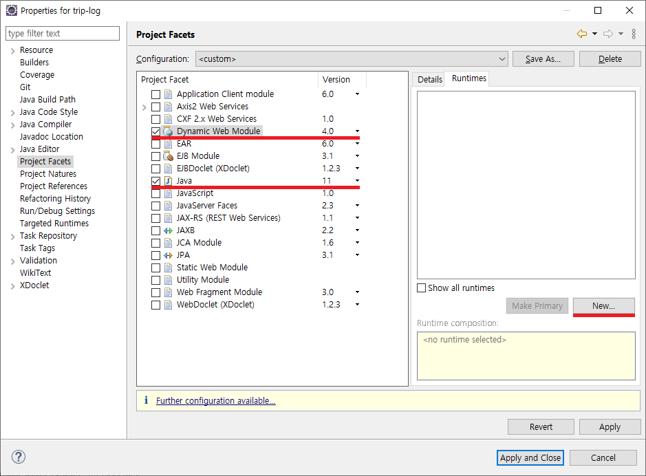

`New`를 눌러 `Tomcat`을 등록할 땐, 새로 열린 창에서 `Apache` 탭을 열고 `Apache Tomcat v9.0`을 선택한 후 다음을 눌러주세요.

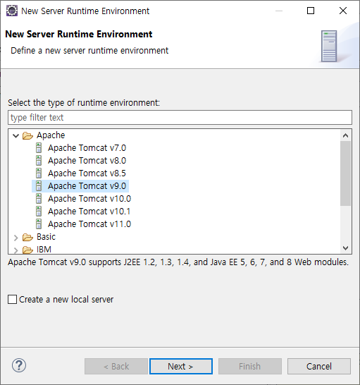

다음 창에서 `Browse...` 버튼을 통해 컴퓨터에 설치된 `Tomcat 9`의 경로를 지정해주세요. 그런 다음 `Finish`를 누르면 됩니다.

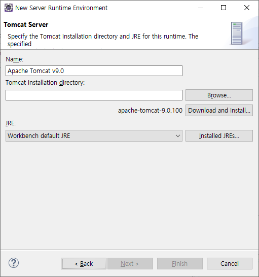

이어서 `Properties for trip-log` 창의 우측 하단에 있는 `Apply and Close` 버튼을 눌러주세요. 그러면 다음과 같이 `Compiler Settings Changed` 창이 뜰 수도
있는데, `Yes` 버튼을 누르시면 됩니다.

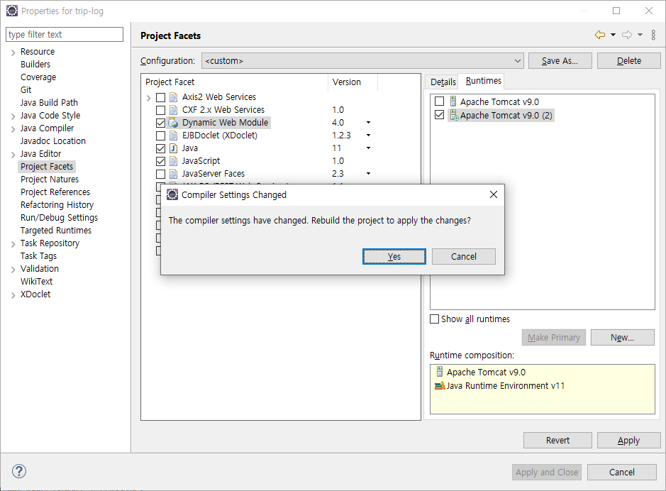

### Context Root 설정

다시 `trip-log` 프로젝트를 우클릭하여 `Properties` 버튼을 눌러주세요. 그러면 좌측의 탭이 이전보다 많아진 것을 확인할 수 있습니다. `Web Project Settings` 탭을 선택해주세요.
그런 다음, `Context root`의 값이 `trip-log`가 아니라면 `trip-log`로 설정해주세요. 그리고 `Apply` 버튼을 눌러주세요.

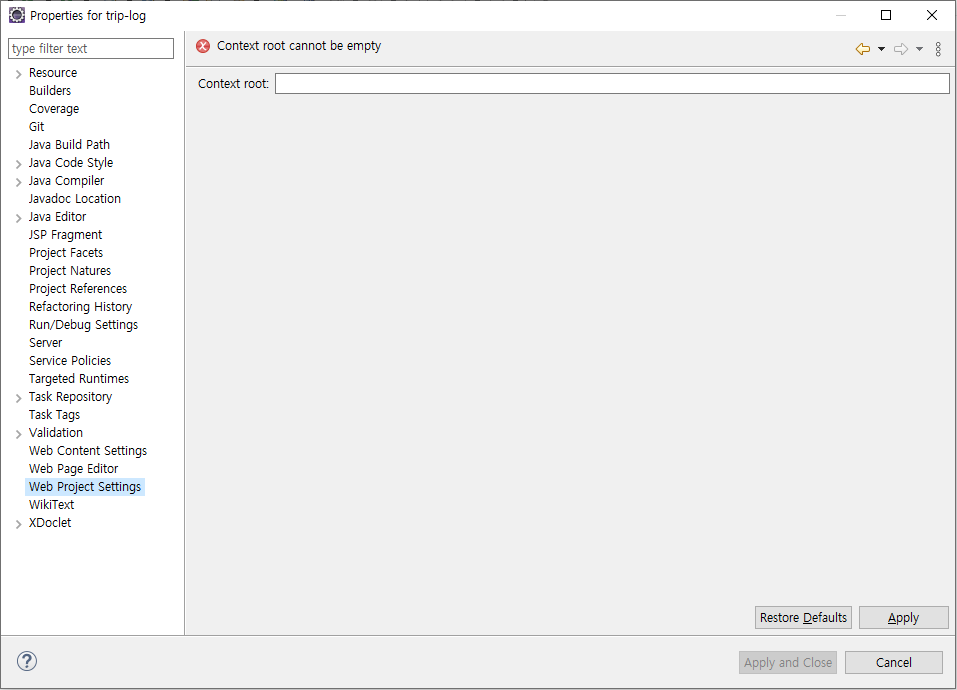

### Build Path 및 의존성 설정

좌측의 `Java Build Path` 탭을 선택해주세요. 상단의 `Source` 탭을 선택한 다음, 우측의 `Add Folder` 버튼과 `Remove` 버튼을 활용하여,
`trip-log/src/main/java`와 `trip-log/src/main/resources`가 있도록 설정하시면 됩니다. 그런 다음 `Apply` 버튼을 눌러주세요.

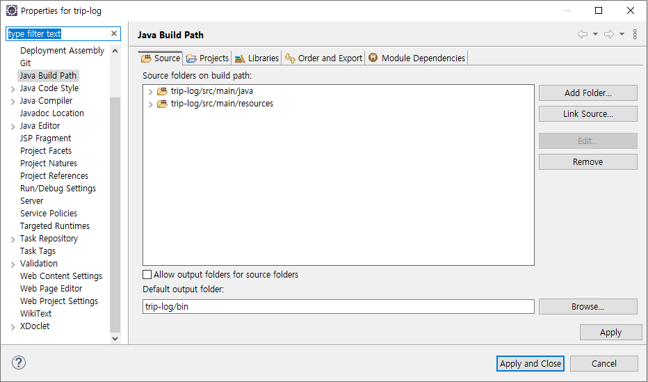

상단의 `Libraries` 탭을 선택해주세요. 영역의 `Classpath` 탭을 선택하신 다음, `Add External JARs...`를 통해 저장해둔 프로젝트가 의존하는 라이브러리들을 추가해주세요. 이 부분은
수업때 했던 것과 같습니다. 그런 다음 `Apply and Close` 버튼을 눌러주세요.

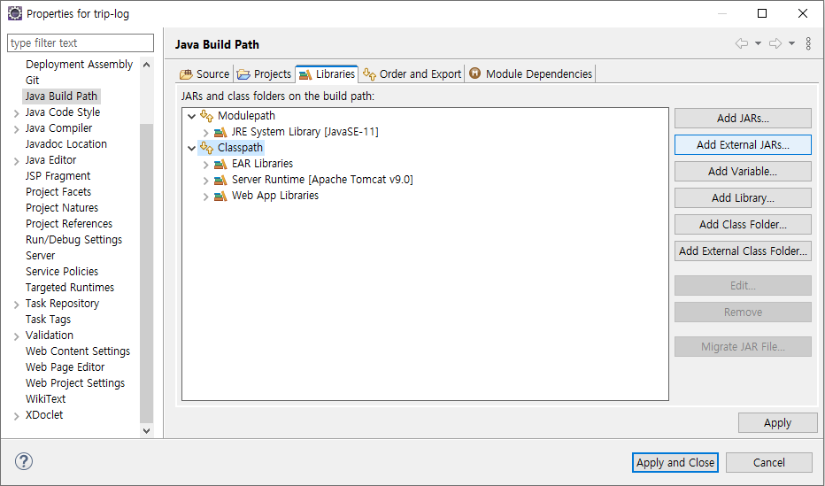

### Deployment Assembly 설정

`trip-log` 프로젝트 바로 아래 `resources` 폴더를 생성해주세요.

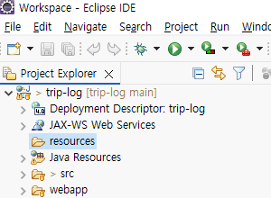

다시 `trip-log` 프로젝트를 우클릭하여 `Properties` 버튼을 눌러주세요. 그리고 좌측의 `Deployment Assembly` 탭을 선택해주세요. 그런 다음, 우측의 `Add Folder` 버튼과
`Remove` 버튼을 활용하여, 다음 표와 동일하게 설정해주세요. `Deploy Path` 열은 값 영역을 클릭하면 값을 수정할 수 있습니다. 그런 다음 `Apply and Close` 버튼을 눌러주세요.

| Source         | Deploy Path     |
|----------------|-----------------|
| /resources     | WEB-INF/classes |
| /src/main/java | WEB-INF/classes |
| /webapp        | /               |

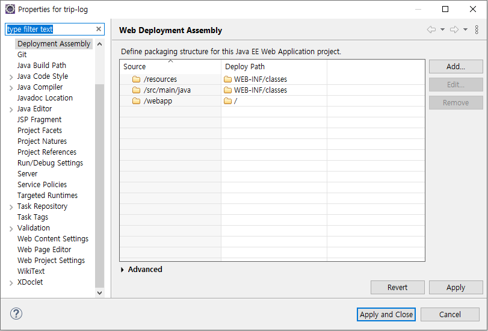

## Server 정의

그러면 이제 설정은 거의 끝났습니다. 하단 탭 중 `Modules` 탭을 선택하고 그 하위 탭인 `Servers` 탭을 선택해주세요.
`No servers are available. Click this link to create a new server...`를 누른 다음 수업에서 배웠던 대로 하면 됩니다.

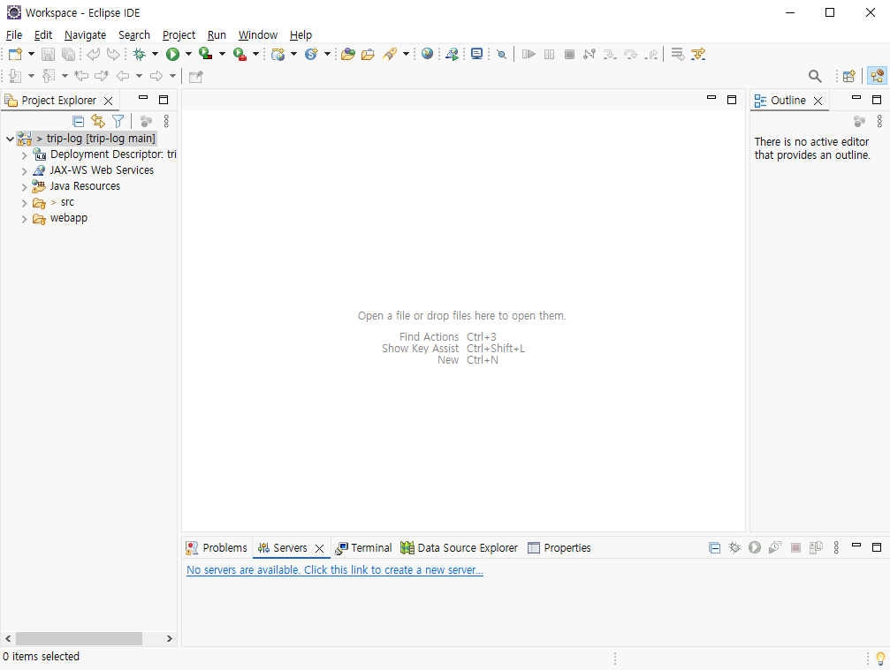

수업에서 했던 것 처럼 서버를 실행하신 다음, `https://localhost:8080/trip-log/` 웹 페이지에 접속하면 프로젝트에 있는 `index.jsp` 페이지가 나타나야 합니다. 포트를 `8080`이 아닌 다른 번호로
지정했다면 그 번호로 접속하세요. `index.jsp` 페이지가 정상적으로 나타난다면, 성공적으로 모든 설정을 마친 겁니다.

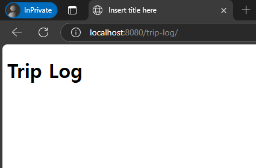